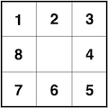

## Motivation

Models are used everywhere in data science. Data models, statistical models, machine learning models - even the latitude/longitude coordinates on your GPS come from a model. But models don't have to be complex. An important aphorism about models states "all models are wrong, but some are useful." In this course you will build a model of a coral reef inspired by the recent history of disturbance and recovery on the Mo'orea reefs. It's not the most sophisticated model in the world, but as you'll see it generates somewhat realistic patterns and it gives you a tangible (and tactile!) goal for your code.

## Model rules

Before you begin modeling the reef, make sure you have all the materials.

* Reef grid (2 laminated sheets)
* Coral tokens (50 in a plastic bag)
* Dice (6d6, 2d8)
* Model instructions
* Paper and pencil

Each "turn" represents two years on the reef. You will simulate growth and mortality of corals by rolling dice and placing tokens. When the model completes the simulation, you will have a time series of coral percent cover from 2004 to 2024.

### Setup

On one grid, randomly place 8 coral tokens live-side up. This represent the coral cover on the reef in 2004.

On the sheet of paper, make two columns: year and pct_coral_cover. In the first row, record 2004 for the year and 32 for the percent coral cover.

Pro-tip: the reef grid has 25 cells, so the percent cover is the number of live corals tokens times four.

### Take a turn

Two years have passed since the last set of observations. Let's simulate what happened on the reef. Keep the grid you updated in the previous turn (or during setup) the same and wipe the tokens from the other grid. The other grid is now the reef in the current turn.

- FOR each cell with a live coral token on the previous turn's grid.
  - Roll 2d6 and add them up. Call this total `outcome`.
  - IF `outcome` is less than or equal to 3:
    - The coral dies. 
    - Place a dead coral token on this turn's grid in the same location.
  - ELSE IF `outcome` is greater than or equal to 6:
    - The coral grows. 
    - Place a live coral token on this turn's grid in the same location.
    - The coral now expands into a neighboring cell. Choose which of the 8 neighboring cells to grow into by rolling your d8. Place a live coral token on the neighboring cell in this turn's grid corresponding to the relative location shown here:
    
    
  - ELSE:
    - The coral neither grows nor dies.
    - Place a live coral token on this turn's grid in the same location.
- Calculate the percent coral cover 
- Add a row to the paper with the year and percent coral cover

### Keep going

Repeat taking turns until your time series runs through 2024.

### CRISES!

Three crises struck Mo'orea's coral reefs during this time period. Crises activate in specific years and change the model rules.

#### Crown of Thorns Crisis

In 2008 and 2010, a plague of Crown of Thorns seastars wrecks devastation on the corals. Change the following rules:

- The threshold for coral death increases from 3 to 4
- No growth occurs

#### Cyclone Crisis

In 2012, a cyclone strikes Mo'orea. Change the following rules:

- No mortality or growth occurs
- Roll a d6 to determine the direction of the cyclone's approach. As the reef is scoured by the storm, remove all tokens from the three columns/rows facing its approach.
  - On a 1-2, the cyclone approaches from the **west**. Remove tokens from the three left columns.
  - On a 3-4, the cyclone approaches from the **north**. Remove tokens from the three top rows.
  - On a 5-6, the cyclone approaches from the **east**. Remove tokens from the three right columns.

#### Marine Heatwave Crisis

In 2022, a marine heatwave caused an intense bleaching event on the reef. Change the following rules:

- The threshold for coral death increases from 3 to 7
- The growth threshold increases from 7 to 10

### Submit your time series

After resolving the model, submit your time series in the spreadsheet [here](https://docs.google.com/spreadsheets/d/1EfCwNVMbd8cBh9pJKQJusnz4jSwW6oBYhr-sGJIa2ng/edit?usp=sharing).

## Student roles

Choose students in your group to perform each of the following roles. 

🎂 **Demography tracker** Keeps track of which coral to resolve growth/mortality for next, and which have already resolved.

🪙 **Token manager** Places, flips, and removes tokens from the grid.

🎲 **Dice roller** Rolls the dice and reports the totals.

📝 **Data recorder** Updates the table as new time series data emerges.

⏳ **Time keeper** Tracks the time and make sures the group is on track to finish. Also writes down any rule ambiguities (and the group decision) encountered.

When the group encounters an ambiguity in the rules, you must reach consensus _as a group_ to decide how to proceed.

🙅 **No laptops while the model is running** 🙅
