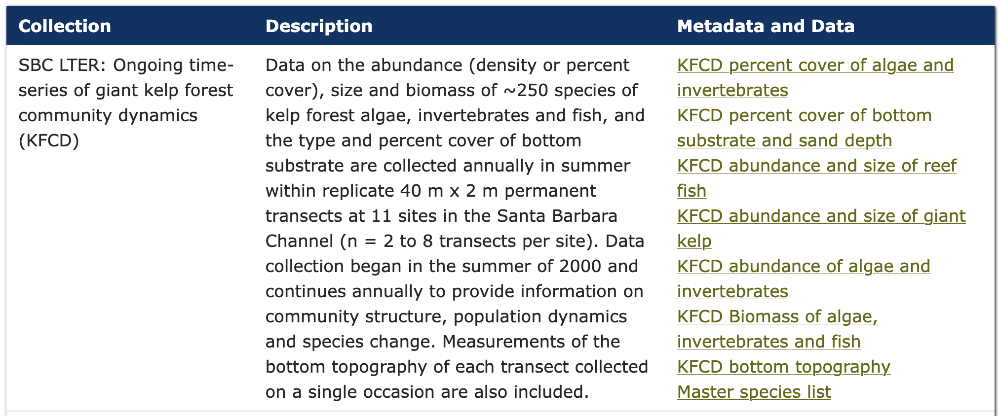

## Goal

So far, the bugs you've debugged have been planted on purpose. That's about to change.

In this activity, you'll perform an _exploratory data analysis_ (EDA) on a real dataset. As you poke and prod your way through the data, you will organically create bugs. At that point you will switch from exploration to debugging. There are five EDA prompts below to get you started. You're not limited to these - they exist to get you diving into the data. The real activity begins when you hit a bug. The goal isn't to finish all five questions below; it's to practice the troubleshooting loop from this morning (and a reprex, if the loop stalls) when something goes wrong.

## Background: SBC LTER

The Santa Barbara Coastal Long Term Ecological Research site (SBC LTER) is based at UC Santa Barbara's Marine Science Institute and has been running since 2000 as part of the National Science Foundation's LTER Network. It studies the giant kelp forest ecosystem along the mainland coast of the Santa Barbara Channel — how oceanographic forces (waves, nutrients, sediment) and species interactions across the food web (kelp, invertebrates, fish, and top predators like spiny lobster) shape the ecosystem over the long term.

SBC LTER publishes dozens of datasets covering everything from satellite-derived kelp canopy to stream chemistry to decades of diver surveys. Rather than hand you one table, this activity turns you loose in the whole [SBC LTER Data Catalog](https://sbclter.msi.ucsb.edu/data/catalog/). Download whatever you need into a `data/` subfolder inside your day 9 folder. Below are five entry points to get you started — one or two datasets per question — but you're free to wander beyond them.

## EDA questions

Here are some options to begin your exploration. You don't need to answer all five, and you are encouraged to choose a different question if something catches your interest. 

1. **Kelp forest community dynamics.** Search the catalog for "Kelp Forest Community Dynamics" (diver counts of reef fish, invertebrates, and algae at permanent transects since 2000): how has the abundance of one species, or a group of them, changed across the record — and does it differ between reef sites?

  

2. **Spiny lobster and fishing pressure.** Using the [Spiny lobster abundance, size, and fishing effort](https://sbclter.msi.ucsb.edu/data/catalog/package/?package=knb-lter-sbc.77) dataset: are lobsters bigger or more abundant at the sites inside Marine Protected Areas (Naples, Isla Vista) than at the sites open to fishing? Does the companion fishing-pressure table track that pattern?
3. **Temperature and kelp.** Combine the [reef mooring bottom temperature](https://sbclter.msi.ucsb.edu/data/catalog/package/?package=knb-lter-sbc.6006) time series with the [kelp canopy](https://sbclter.msi.ucsb.edu/data/catalog/package/?package=knb-lter-sbc.74) data above: does a spike in bottom temperature at a site (the 2014–2016 marine heatwave, a.k.a. "the Blob," is a good place to look) line up with a drop in that site's kelp canopy biomass?
4. **Stream chemistry.** Using [Stream chemistry in the Santa Barbara Coastal drainage area](https://sbclter.msi.ucsb.edu/data/catalog/package/?package=knb-lter-sbc.6): do nutrient concentrations (nitrate, ammonium, or soluble reactive phosphorus) spike during winter storms compared to summer?

## What to do when you hit a bug

You will hit a bug! When you do:

1. **Work it with a peer first.** Turn to the person next to you and run the loop from this morning: **Observe → Hypothesize → Test → Proceed.** Observe the code and the error together, list your assumptions, prioritize the ones closest to the error, and test them one at a time.
2. **If you exhaust the loop and you're still stuck, make a reprex.** Strip your code down to the smallest version that still reproduces the error, make sure it's self-contained (build any data it needs within the snippet itself), and run `reprex::reprex()` to generate a clean, shareable version. Share it with an instructor or in the class channel.

::: {.callout-tip}

Building the reprex is often the fix. Minimizing your code forces you to look hard at exactly what triggers the error — most people find the bug themselves partway through writing it.

:::
