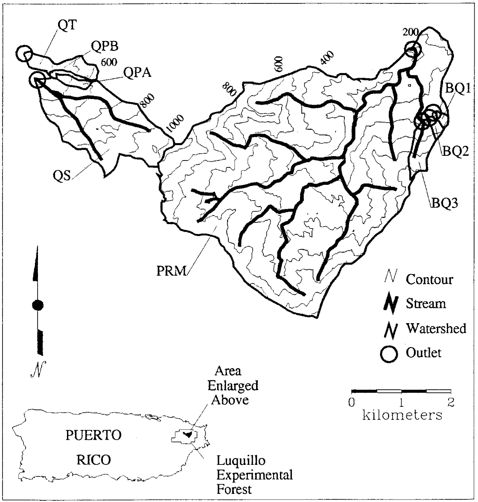
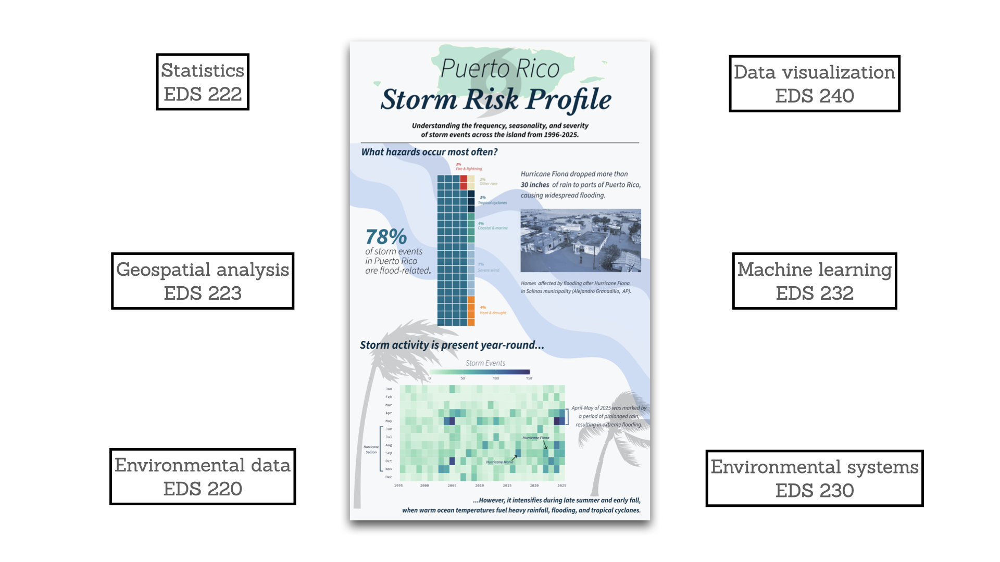

---
format:
  revealjs:
    slide-number: true
    highlight-style: a11y
    chalkboard: true
    theme:
      - ../../meds-slides-styles.scss
execute:
  echo: true
bibliography: references.bib
---

##  {#title-slide data-menu-title="Title Slide" background="#053660"}

[EDS 221 Day 10 AM]{.custom-title}

[*Hurricanes and stream chemistry*]{.custom-subtitle}

<hr class="hr-teal">

[August 21^st^, 2026]{.custom-subtitle3}

------------------------------------------------------------------------

##  {#hurricane-hugo data-menu-title="Hurricane Hugo"}

[Hurricane Hugo]{.slide-title}

<hr>



------------------------------------------------------------------------

##  {#study-site data-menu-title="Study site"}

[Study site: the Luquillo Experimental Forest]{.slide-title}

<hr>


------------------------------------------------------------------------

##  {#hurricane-effects data-menu-title="Effects of the hurricane on streams"}

[Effects of the hurricane on streams]{.slide-title}

<hr>


::::: columns
::: column



:::
::: column

.png)

@schaefer2000 reported on the changes in stream water chemistry in the period following the hurricane.

In EDS 221, you will reproduce this analysis and others from the original study.

:::
:::::

------------------------------------------------------------------------

##  {#moving-average data-menu-title="Moving average"}

[Smoothing with a moving average]{.slide-title}

<hr>

Raw measurements, irregularly sampled, are noisy and confounding

::::: columns
::: column

```{r}
#| echo: false
#| message: false

library(tidyverse)
set.seed(221)
observed <- tibble(
  t = ymd("2020-06-01") + cumsum(runif(20, 2, 6)),
  y = sin(runif(20, 0, 4 * pi)),
  y2 = y + rnorm(20, 0, 0.5)
)
smoothed <- tibble(
  t = seq(observed$t[1], observed$t[20], by = "1 week"),
  y2 = map_dbl(t, \(.t) {
    .x <- with(observed, y2[between(t, .t - 4, .t + 4)])
    if (length(.x) > 0) mean(.x) else NA
  })
)
p <- ggplot(observed, aes(t, y2)) +
  geom_point(shape = 21, color = "grey20", fill = "white") +
  theme_bw(32) +
  theme(
    axis.title = element_blank(),
    panel.grid.minor = element_blank(),
    axis.text = element_blank()
  )
p
```

:::
::: {.column .fragment}

```{r}
#| echo: false
#| message: false

p +
  geom_line(data = smoothed, linewidth = 1.5, color = "cornflowerblue") +
  geom_point(
    data = smoothed,
    color = "cornflowerblue",
    shape = 21,
    fill = "white"
  )
```

:::
:::::

[Smoothed data reveal key patterns]{.fragment}

------------------------------------------------------------------------

##  {#aha data-menu-title="'A ha!' moments"}

[Did you have an "A ha!" moment?]{.slide-title}

<hr>

:::: {.columns}
::: {.column}

{height="500"}

:::
::: {.column}

{height="500"}
:::
::::

------------------------------------------------------------------------

##  {#up-to-now data-menu-title="Up to now"}

[The path up to now]{.slide-title}

<hr>

Remember where we started?

```r
set.seed(123)
die <- 1:6
rolls <- sample(die, size = 2, replace = TRUE)
roll_total <- sum(rolls)
```

<br />

Since then we:

- Made a kajillion concept maps
- Sleuthed a hundred pages of code (maybe more?)
- Gave/received a pep talk or three

------------------------------------------------------------------------

##  {#take-with-you data-menu-title="Take with you"}

[What will you take with you?]{.slide-title}

<hr>



------------------------------------------------------------------------

##  {#thank-you data-menu-title="Thank you"}

[Thank you!]{.slide-title}

<hr>


::: {.columns}

::: {.column width=33% .fragment .center-text}


The world's greatest TA!

:::

::: {.column width=33% .fragment .center-text}

{height="200"}
{height="200"}

The Bren School staff

:::

::: {.column width=33% .fragment .center-text}

<br/>

[All of you!]{.body-text-xl}

:::

:::

------------------------------------------------------------------------

##  {#only-one-thing .center data-menu-title="Only one thing"}

[If you only take away one thing...]{.slide-title}

<hr>

::: {.center-text}
[This class was your _first_ opportunity to learn computational thinking, not your _only_ opportunity.]{.body-text-xl}

[You'll keep developing these skills for the rest of your career.]{.body-text-xl}
:::

------------------------------------------------------------------------
