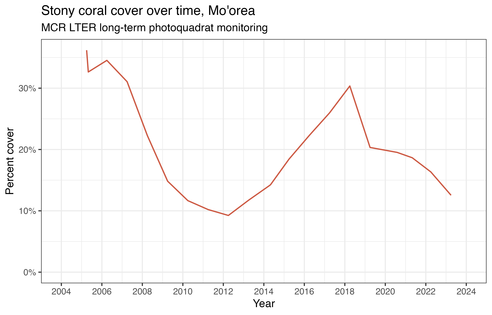
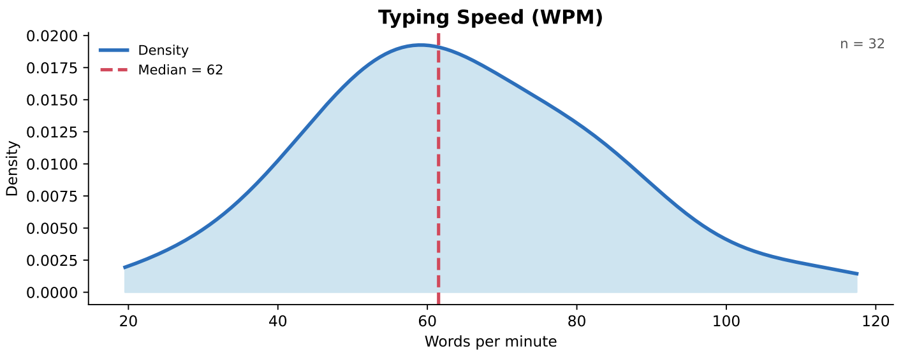

## {#title-slide data-menu-title="Title Slide" background="#053660"} 

[EDS 221 Day 1 AM]{.custom-title}

[*Course intro*]{.custom-subtitle}

[August 10^th^, 2025]{.custom-subtitle3}

---

## {#corals data-menu-title="Corals"} 

{fig-alt="An image of two coral reefs. On the left, a healthy coral reef. On the right, a dead coral predated by a crown-of-thorns sea star." fig-align="center"}

::: {.center-text .body-text-m}
What happened to this system?

What are the consequences for people and the environment? 

Why are we talking about this in a programming class?
:::

---

## {#data-understanding-1 data-menu-title="From data to understanding"} 

[From data to understanding]{.slide-title}

::: {.center-text .body-text-m}
With code, we go from this...
:::

{fig-alt="An image of a diver collecting data in a coral reef." fig-align="center"}

---

## {#data-understanding-2 data-menu-title="From data to understanding"} 

[From data to understanding]{.slide-title}

::: {.center-text .body-text-m}
...to this.
:::

{fig-alt="A figure showing coral reef cover changing over time." fig-align="center"}

---

## {#learning-objectives data-menu-title="Learning objectives"} 

[Learning objectives]{.slide-title}

- 🧠 **Think** like a computer scientist
    - 🌍 Represent real world data using computational [_data structures_]{.yellow-highlight}
    - 🤖 Interpret and design [_algorithms_]{.yellow-highlight} to solve problems
    - 🍄 [_Decompose complex problems_]{.yellow-highlight} into modular components
- 🎨 **Create** like a computer scientist
    - 🔠 [_Read and write code_]{.yellow-highlight} using proper syntax
    - 🛠 Implement algorithms with [_control structures and functions_]{.yellow-highlight}
    - 👷 Manage coding projects using [_version control_]{.yellow-highlight}

---

## {#grading data-menu-title="Grading"} 

[Grading]{.slide-title}

::: {.body-text-m}
- 👍 Satisfactory / Unsatisfactory
  - No letter grades
- ✅ Attendance
  - Expected every day.
  - But life happens! Let your instructors know about absences in advance when possible.
- ✋ Participation
  - Active participation in all exercises expected.
:::

---

## {#daily-schedule data-menu-title="Daily schedule"} 

[Daily schedule]{.slide-title}

::: {.body-text-m}
::: {.columns}
::: {.column width="50%"}
- **Morning session**
  - Review previous day
  - New material
  - Session review
- **Afternoon session**
  - New material
  - Session review
- **End-of-day session**
  - Practice day's material
:::

::: {.column width="50%"}
- **Session activities**
  - Pencil-and-paper exercises
  - Live-coding demos
  - Concept mapping
- Expect a lot of:
  - Working in groups
  - Problem solving
  - Think first, draw second, type last
:::
:::
:::

---

## {#typing-club data-menu-title="Typing club"} 

[Have your coffee with typing club!]{.slide-title}

::: {.center-text .body-text-m}
💻 💻 💻 Touch typing is a valuable skill for keeping up in class, and one you can develop.

_But why practice alone?_

☕ ☕ ☕ Join typing club 9:15-9:45, here in the NCEAS classroom. I'll make the coffee (there will be tea, too), we'll practice typing together.

:::

---

## {#course-schedule data-menu-title="Course schedule"} 

[Course schedule]{.slide-title}

::: {.table-text-m}
| Week 1 | Week 2 |
|---|---|
| Day 1 - Code execution | Day 6 - Data frames |
| Day 2 - Data structures | Day 7 - Manipulating data |
| Day 3 - Control structures | Day 8 - Advanced data types |
| Day 4 - Functions | Day 9 - Troubleshooting |
| Day 5 - Creating programs | Day 10 - Review |
:::

---

## {#degree-schedule data-menu-title="Degree schedule"} 

[Degree schedule]{.slide-title}

::: {.columns}
::: {.column width="40%"}
::: {.tight-list}
- **Fall**
  - Statistics
  - Environmental data
  - Geospatial analysis
  - Ethics and bias
- **Winter**
	- More statistics
	- Data visualization
	- Environmental systems
	- Capstone I
- **Spring**
	- Machine learning
	- Databases
	- Capstone II
:::
:::

::: {.column width="60%"}
::: {.body-text-m}
All these classes use programming!

But since you haven’t taken them yet, in the meantime we’ll use programming to build…
:::
:::
:::

---

## {#coral-reef-model data-menu-title="Coral reef model"} 

[Coral reef model]{.slide-title}

---

