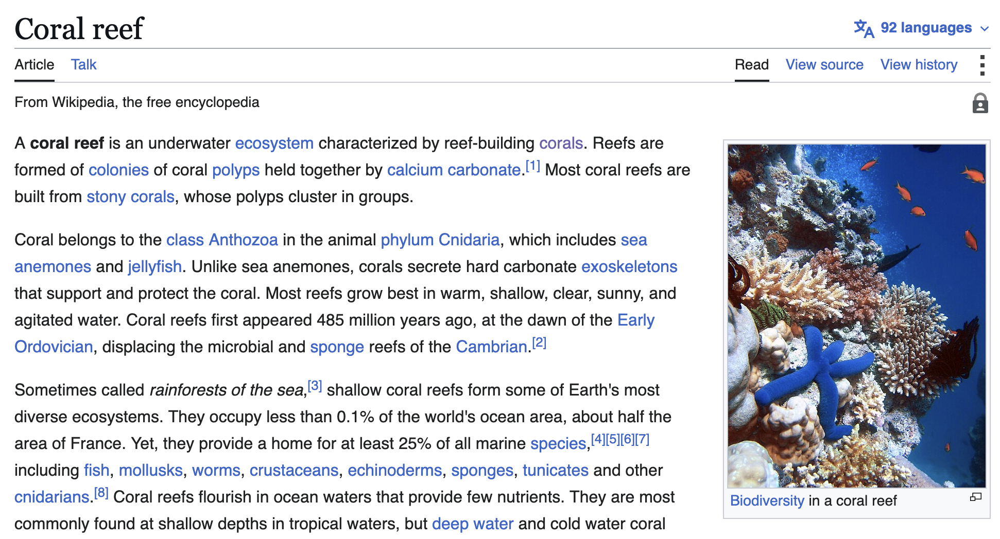
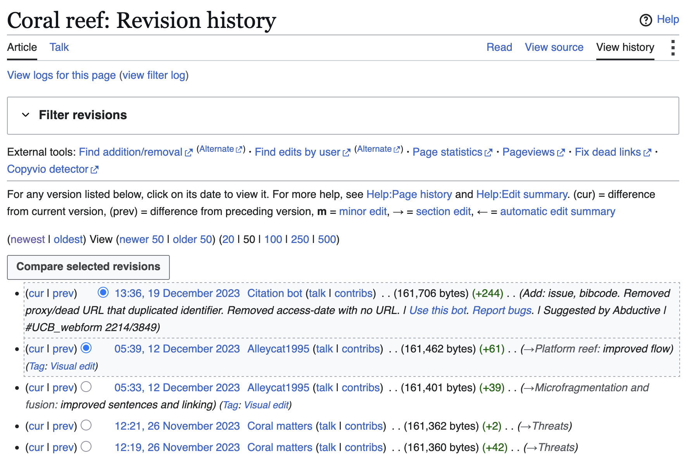
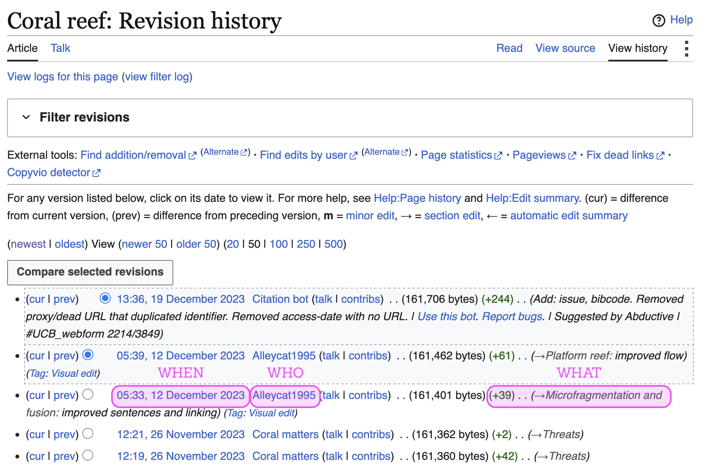
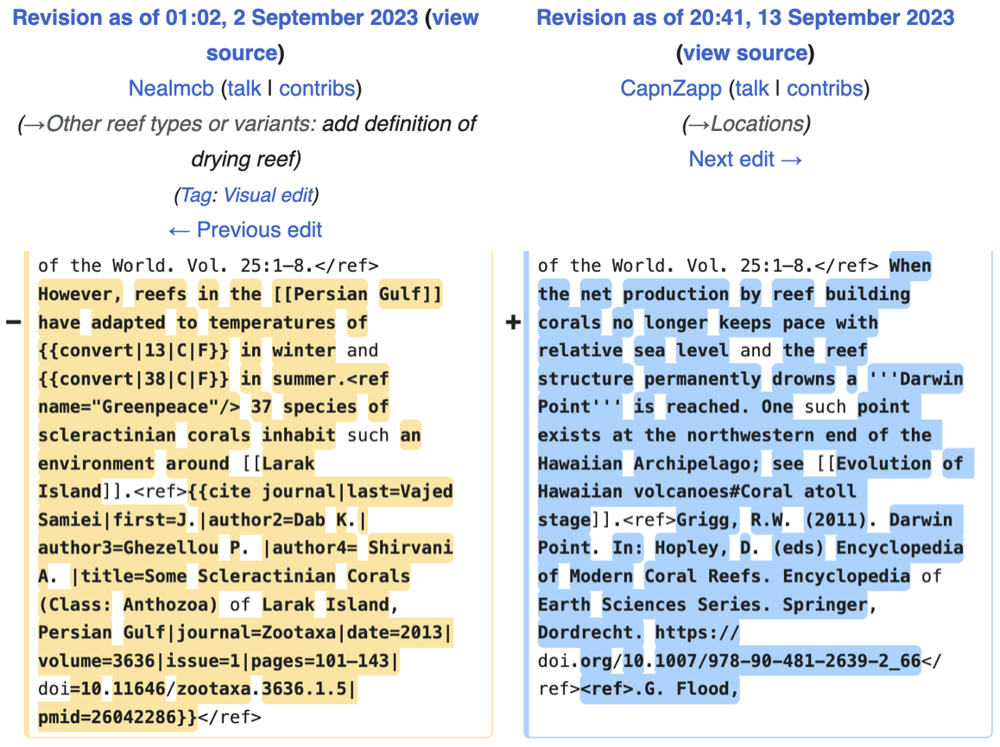
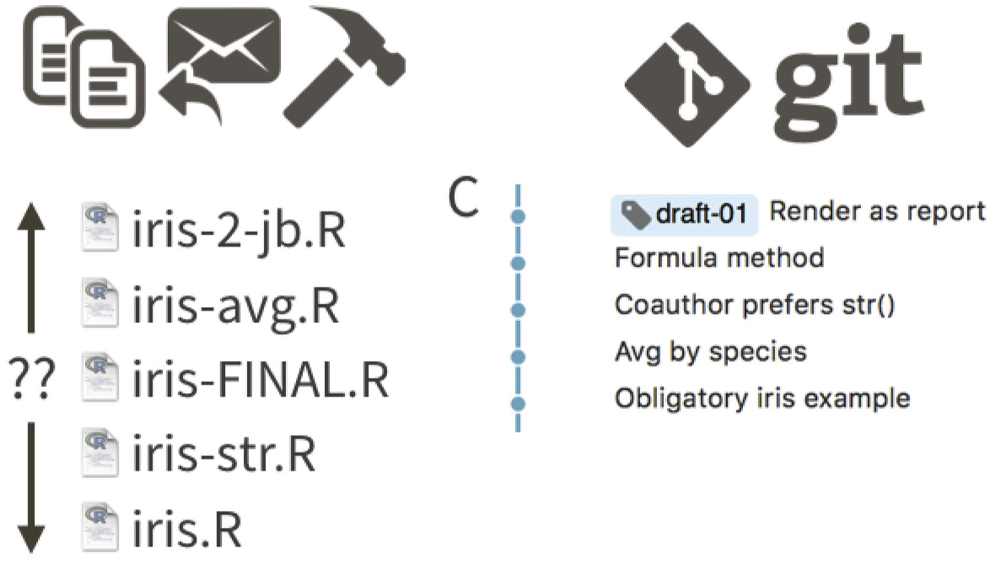

## {#title-slide data-menu-title="Title Slide" background="#053660"} 

[EDS 221 Day 1 PM]{.custom-title}

[*Version control*]{.custom-subtitle}

[August 10^th^, 2025]{.custom-subtitle3}

---

## {#corals data-menu-title="Corals"} 

::: {.center-text .body-text-m}

Anyone can edit Wikipedia - how do you keep all those changes organized?
:::

---

## {#version-history data-menu-title="Version history tracks changes over time"}

[Version history tracks changes over time]{.slide-title}

::: {.center-text .body-text-m}
Each contribution is individually recorded.
:::

{.r-stretch}

---

## {#version-history2 data-menu-title="Version history tracks changes over time"}

[Version history tracks changes over time]{.slide-title}

::: {.center-text .body-text-m}
Details about _when_, _who_, and _what_ are linked to a set of **changes**.
:::

{.r-stretch}

---

## {#diffs data-menu-title="Differences"}

[_Differences_ highlight exact changes]{.slide-title}

::: {.center-text .body-text-m}
With version history, changes can be tracked to individual lines.
:::

{.r-stretch}

---

## {#no-version-control data-menu-title="Let's avoid this"}

[Version control lets us avoid _this_]{.slide-title}

{.r-stretch}

---

## {#code-version-control data-menu-title="Code version control"}

[Pardon me, I want to write code, not encyclopedias]{.slide-title}

::: {.columns}

::: {.column}

**git** is the most widespread tool for version control of code.

Like Wikipedia’s revision history, it tracks _when_, _who_, and _what_, with line-by-line differences.

:::

::: {.column}

**GitHub** is the most widespread platform for hosting git repositories

It helps you collaborate, simplifying access and project management

:::

:::

---

## {#live-coding data-menu-title="Live coding demo"} 

[Live coding demo]{.slide-title}

---

