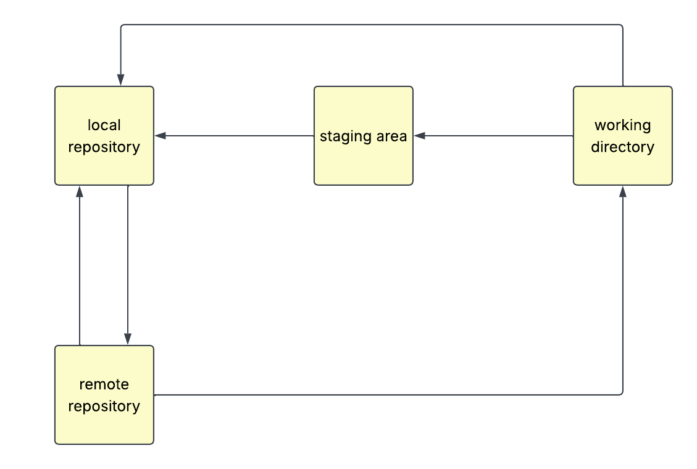

## {#title-slide data-menu-title="Title Slide" background="#053660"} 

[EDS 221 Day 2 AM]{.custom-title}

[*Data types and 1d structures*]{.custom-subtitle}

<hr class="hr-teal">

[August 11^th^, 2026]{.custom-subtitle3}

---

## {#review-day1-code-execution data-menu-title="Review day 1: Code execution"} 

[Review day 1: Code execution]{.slide-title}

<hr>

What’s the value of x after you execute these commands? 

What output would you see at the console?

```r
x <- 10
x + 1
y <- x
y <- y * 2
x
y
```

---

## {#review-day1-version-control data-menu-title="Review day 1: Version control"} 

[Review day 1: Version control]{.slide-title}

<hr>

Label the arrows in the following diagram with the corresponding git command.



---

## {#create-datasheet data-menu-title="Create a datasheet"} 

[Create a datasheet]{.slide-title}

<hr>


---

## {#types data-menu-title="Atomic types"} 

[Atomic types]{.slide-title}

<hr>

::: {.columns}

::: {.column}

There are four **atomic types** in R.

- Character (text)
- Double (decimal numbers)
- Integer (round numbers)
- Logical (true and false)

:::

::: {.column}

Atomic types are the basic building blocks of data structures in R.

Like the name implies, everything else is made out of them.

:::

:::

---

## {#coercion data-menu-title="Coercion"} 

[Coercion]{.slide-title}

<hr>

Atomic vectors have to be _one type_. When you combine vectors of different types, one gets coerced into the other's type.


---

## {#making-vectors data-menu-title="Making vectors"} 

[Making vectors]{.slide-title}

<hr>

There are many ways to make vectors. Some of the most common are:

::: {.columns}

::: {.column}

```{r}
#| echo: true

# Sequence operator
2:4

# c() function
c("Violet", "Cyan")
```

:::

::: {.column}

```{r}
#| echo: true

# Vector constructors
character(5)
double(5)

# Random number generators
rnorm(3, mean = 0, sd = 1)
rpois(4, lambda = 10)
```

:::

:::

---
