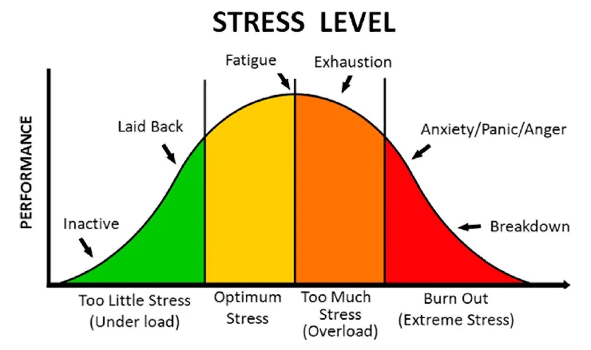

## {#title-slide data-menu-title="Title Slide" background="#053660"} 

[EDS 221 Day 5 AM]{.custom-title}

[*Creating programs: planning*]{.custom-subtitle}

<hr class="hr-teal">

[August 14^th^, 2026]{.custom-subtitle3}

---

## {#optimal-stress data-menu-title="Optimal stress"} 

[Optimal stress]{.slide-title}

<hr>



---

## {#exponential-complexity data-menu-title="Exponential complexity"} 

[Exponential complexity]{.slide-title}

<hr>

```{r}
#| echo: false
#| message: false

library(tidyverse)
tibble(
  x = seq(0, 4, length.out = 100),
  `Complexity of individual concepts` = 1 + x^2,
  `Cumulative cognitive complexity` = exp(x)
) |>
  pivot_longer(-1) |>
  ggplot(aes(x, value, color = name)) +
  geom_line(linewidth = 2) +
  scale_color_manual(values = c("firebrick", "cornflowerblue")) +
  theme_void(18) +
  theme(
    legend.title = element_blank(),
    legend.position = "inside",
    legend.position.inside = c(0.1, 0.9),
    legend.justification = c(0, 1)
  )
```

---

## {#course-goals data-menu-title="Course goals"} 

[Course goals]{.slide-title}

<hr>

::: {.columns}

::: {.column width="30%"}

**_Must_**

Grasp sufficient building blocks to continue your learning in the future.

<br/>

_You learned the alphabet and some basic vocabulary_

:::

::: {.column width="30%"}

**_Ideally_**

Develop intuition about how to use data structures, control structures, and functions.

<br/>

_You can write with correct grammar_

:::

::: {.column width="30%"}

**_Maybe_**

Fluently read and write code in R.

<br/>

_You can hold a conversation_

:::

:::

---

## {#progress-check data-menu-title="Progress check"} 

[Progress check]{.slide-title}

<hr>

**_Written assessment_**

- 4 sets of 3 questions
  - 1 set for each day this week
- Questions increase in complexity
  - 1st question: building blocks
  - 2nd question: intuition
  - 3rd question: fluency

---

## {#problem-decomposition data-menu-title="Problem decomposition"} 

[Problem decomposition]{.slide-title}

<hr>

{fig-align="center"}

<br/>

::: {.columns}

::: {.column}

We're going to re-run the coral reef model.

The model is a _complex problem_.

This time, as you're running it, focus on finding _simpler problems_.

:::

::: {.column}

In the afternoon session, we'll solve the simpler problems and put the whole thing together.

**_Problem decomposition_** is how we apply our building blocks to solve complex problems.

:::

:::

---

## {#identifying-components data-menu-title="Identifying components"} 

[Identifying components]{.slide-title}

<hr>

::: {.columns}

::: {.column}

[What makes for a good component?]{.body-text-l}

- Not too big, not too small
- Only one ultimate goal
- (Relatively) self-contained

:::

::: {.column}

[Good]{.body-text-l}

- “Roll 2d6”
- “Initialize the reef”
- “Grow a coral”

[Needs revision]{.body-text-l}

- “Apply crisis rules” (too big)
- “Set cell to 1” (too small)
- “Loop through the years” (not self-contained)

:::

:::

---

## {#component-example data-menu-title="Example of a component"} 

[Example of a component]{.slide-title}

<hr>

[Roll 2d6]{.body-text-l}

- _Not too big, not too small._ Replacing `sum(sample(1:6, size = 2, replace = TRUE))` with `roll2d6()` improves clarity.
- _Only one ultimate goal._ It calculates 1 number.
- _(Relatively) self-contained._ No dependencies at all, simplest case.

---

## {#component-your-turn data-menu-title="Find a component"} 

[Find a component]{.slide-title}

<hr>

[**_Your turn_**]{.body-text-l}

1. Find your group (see activity on course website)
2. Run the model again
3. As you run it, identify a component of the model
4. Describe the component on your group's slide
5. Share with the class

---
