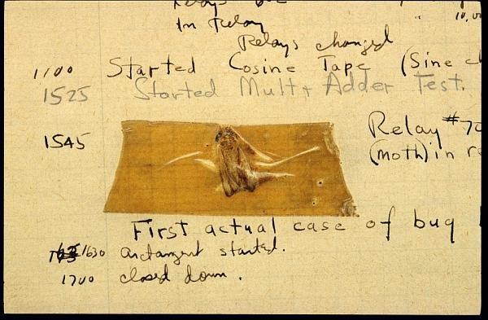

---
format:
  revealjs:
    slide-number: true
    # code-link: true
    highlight-style: a11y
    chalkboard: true
    theme:
      - ../../meds-slides-styles.scss
execute:
  echo: true
bibliography: references.bib
---

##  {#title-slide data-menu-title="Title Slide" background="#053660"}

[EDS 221 Day 9 AM]{.custom-title}

[*Troubleshooting*]{.custom-subtitle}

<hr class="hr-teal">

[August 20^th^, 2026]{.custom-subtitle3}

------------------------------------------------------------------------

##  {#so-many-functions data-menu-title="So many functions!"}

[So many functions!]{.slide-title}

<hr>

[How do I remember:]{.body-text-m}

- `ymd()` vs `mdy()`?
- `fct_reorder()` vs `fct_relevel()`?
- `pivot_wider()` vs `pivot_longer()`?

------------------------------------------------------------------------

##  {#posit-cheatsheets data-menu-title="Posit Cheatsheets"}

[Posit Cheatsheets]{.slide-title}

<hr>

](images/posit-cheatsheets.png)

------------------------------------------------------------------------

##  {#posit-cheatsheets-lubridate data-menu-title="Posit Cheatsheets: `lubridate`"}

[Posit Cheatsheets: `lubridate`]{.slide-title}

<hr>

](images/lubridate.png)

------------------------------------------------------------------------

##  {#posit-cheatsheets-forcats data-menu-title="Posit Cheatsheets: `forcats`"}

[Posit Cheatsheets: `forcats`]{.slide-title}

<hr>

](images/factors.png)

------------------------------------------------------------------------

##  {#talk-bugs data-menu-title="Let's talk about bugs"}

[Let's talk about bugs]{.slide-title}

<hr>



------------------------------------------------------------------------

##  {#bug-iceberg data-menu-title="Hitting a bug"}

[Hitting a bug feels like hitting an iceberg]{.slide-title}

<hr>


------------------------------------------------------------------------

##  {#debugging-panic data-menu-title="You'll feel like panicking"}

[You'll feel like panicking]{.slide-title}

<hr>


------------------------------------------------------------------------

##  {#stay-calm data-menu-title="Stay calm"}

[But stay calm - you got this!]{.slide-title}

<hr>


------------------------------------------------------------------------

##  {#whence-bugs data-menu-title="Where do bugs come from?"}

[Where do bugs come from?]{.slide-title}

<hr>

::::: columns
::: column

:::

::: column
Bugs originate from **errors in mental models** [@ko2005]

What kinds of _mental models_ have you developed in this course?

:::
:::::

------------------------------------------------------------------------

##  {#bugs-are-friends data-menu-title="Bugs are your friends"}

[Bugs are your friends]{.slide-title}

<hr>

::::: columns
::: column

:::

::: column
When you encounter a bug, the trivial goal is to fix the bug itself.

The more important goal is to use the bug to diagnose the error in your mental model.

Bugs are your friends! They teach you to be better programmers!
:::
:::::

------------------------------------------------------------------------

##  {#systematic-approach data-menu-title="Take a systematic approach"}

[Take a systematic approach]{.slide-title}

<hr>

:::::: columns
::: column
### 1. Observe

Look closely at the code and the outputs. Make a list of your assumptions about _how the code works_. 

### 2. Hypothesize

Analyze your assumptions. One of them probably has an error! Which ones seem _closest to the source of the bug_?

### 3. Test

Pick one assumption and test it. 

### 4. Proceed

Continue testing, and ruling out, assumptions until you figure out the root cause.
:::
::: column

:::
::::::

------------------------------------------------------------------------

##  {#bug-in-the-wild data-menu-title="A bug, in the wild"}

[A bug, in the wild]{.slide-title}

<hr>

[Let's apply the loop to a real bug from the coral reef data.]{.body-text-m}

```{r}
#| message: false
#| warning: false
#| error: true
library(tidyverse)

moorea_coral <- read_csv("data/moorea_coral.csv")

distinct_corals <- unique(moorea_coral$Taxonomy_Substrate_or_Functional_Group)
distinct_corals[-1:4]
```

------------------------------------------------------------------------

##  {#step1-observe .smaller data-menu-title="Step 1: Observe"}

[Step 1: Observe]{.slide-title}

<hr>

```r
library(tidyverse)

moorea_coral <- read_csv("data/moorea_coral.csv")

distinct_corals <- unique(moorea_coral$Taxonomy_Substrate_or_Functional_Group)
distinct_corals[-1:4]
```

List assumptions about how the code works.

- `moorea_coral` is a data frame
- It has a column called `Taxonomy_Substrate_or_Functional_Group`
- `unique()` returns a character vector
- `distinct_corals` has more than 4 values in it
- -1:4 evaluates to -1, -2, -3, -4
- [-1:4] drops the first four elements from a vector
- The result is the unique "corals" in the dataset (except the first four)

------------------------------------------------------------------------

##  {#step2-hypothesize data-menu-title="Step 2: Hypothesize"}

[Step 2: Hypothesize]{.slide-title}

<hr>

The error message says:

```bash
Error in `distinct_corals[-1:4]`:
! only 0's may be mixed with negative subscripts
```

That leads me to believe the error is in the indexing. So I will prioritize these assumptions:

- `distinct_corals` has more than 4 values in it
- -1:4 evaluates to -1, -2, -3, -4
- [-1:4] drops the first four elements from a vector

------------------------------------------------------------------------

##  {#step3-test data-menu-title="Step 3: Test"}

[Step 3: Test]{.slide-title}

<hr>

Begin with the assumption:

- `distinct_corals` has more than 4 values in it

I'll use the length function to test that assumption.

```{r}
length(distinct_corals)
```

This assumption holds up - it's not the source of the bug.

------------------------------------------------------------------------

##  {#step4-proceed data-menu-title="Step 4: Proceed"}

[Step 4: Proceed]{.slide-title}

<hr>

Move on to the next assumption:

- -1:4 evaluates to -1, -2, -3, -4

Let's check it out.

```{r}
-1:4
```

This assumption fails - revealing the error in my mental model. Now I can fix both the bug _and_ my understanding of sequences.

------------------------------------------------------------------------

##  {#activity-setup data-menu-title="Activity: find the bugs"}

[Your turn: find the bugs]{.slide-title}

<hr>

[There are **8 bugs** scattered around the room.]{.body-text-l}

Form **eight groups**, one at each bug.

------------------------------------------------------------------------

##  {#activity-round1 data-menu-title="Round 1: Brainstorm"}

[Round 1: Brainstorm]{.slide-title}

<hr>

For **5 minutes**, brainstorm assumptions about how the code works.

Write down as many assumptions as you can, one per sticky note.

------------------------------------------------------------------------

##  {#activity-round2 data-menu-title="Round 2: Prioritize"}

[Round 2: Prioritize]{.slide-title}

<hr>

Rotate to the next bug.

1. Go through the previous group's brainstorm.
2. Pick the **two assumptions** you think are most likely related to the source of the bug.
3. Move those two sticky notes into the boxes above.

------------------------------------------------------------------------

##  {#activity-round3 data-menu-title="Round 3: Test one"}

[Round 3: Test]{.slide-title}

<hr>

Rotate to the next bug.

1. Pick one of the prioritized assumptions from the previous group.
2. Describe a test for that assumption.

------------------------------------------------------------------------

##  {#activity-round4 data-menu-title="Round 4: Test the other"}

[Round 4: Test]{.slide-title}

<hr>

Rotate one more time.

Describe a test for the last remaining assumption.

------------------------------------------------------------------------

##  {#reprex-intro data-menu-title="When you need help"}

[When the loop stalls: make a reprex]{.slide-title}

<hr>

[Sometimes you work through Observe -> Hypothesize -> Test -> Proceed and you're still stuck. Time to ask for help.]{.body-text-m}

A **reprex** ("**repr**oducible **ex**ample") is a small, self-contained snippet that lets someone else run into your exact bug.

Building one is a debugging tool in itself: about 80% of the time, making a good reprex reveals the source of the problem before anyone else even looks at it.

------------------------------------------------------------------------

##  {#reprex-qualities data-menu-title="What makes a good reprex"}

[A good reprex is...]{.slide-title}

<hr>

:::::: columns
::: {.column width="33%"}
### Reproducible

Include everything needed to run it: `library()` calls, any data, and the code itself. Someone else should be able to copy-paste and get your exact error.
:::
::: {.column width="33%"}
### Minimal

Strip away everything unrelated to the bug. Use the smallest, simplest data that still triggers the problem.
:::
::: {.column width="33%"}
### Self-contained

Don't rely on objects that only exist in your environment. Build any data the code needs *within* the reprex, before the problem code runs.
:::
::::::

------------------------------------------------------------------------

##  {#reprex-workflow data-menu-title="Making a reprex"}

[Making a reprex]{.slide-title}

<hr>

1. Write the smallest version of your code that still reproduces the bug.
2. Copy it to your clipboard.
3. Run:

```r
reprex::reprex()
```

4. `reprex()` runs your code in a fresh R session and copies a nicely formatted, ready-to-paste version — including output and errors — back to your clipboard.
5. Paste it wherever you're asking for help (Slack, GitHub issue, etc).

------------------------------------------------------------------------

##  {#reprex-example data-menu-title="Reprex example"}

[Before and after]{.slide-title}

<hr>

:::::: columns
::: column
### ❌ Not a reprex

> "My `mean()` isn't working, it just gives me `NA`, please help!!"

No code, no data, no error message — nobody can reproduce this.
:::
::: column
### ✅ A reprex

```r
y <- c(1, 2, NA, 4)
mean(y)
#> [1] NA
```

Runnable, minimal, and shows exactly what's happening.
:::
::::::

------------------------------------------------------------------------
